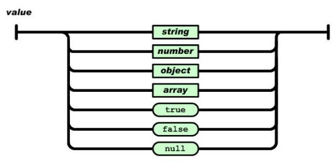
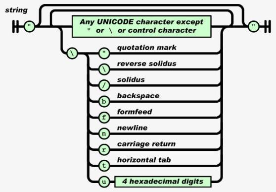
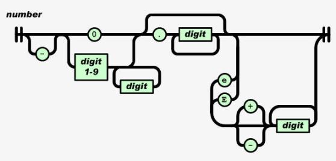
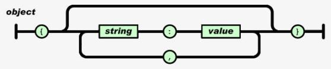
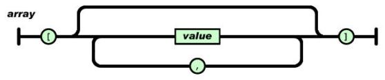

# JavaScript Object Notation

JSON es un formato ligero de intercambio de datos basado en texto plano definido por [Douglas Crockford](https://crockford.com) en 2002.

## Introducción

El intercambio de datos en la informática es la transmisión estructurada de información entre sistemas o aplicaciones totalmente independientes. Para que esta transmisión sea posible y la información comprensible para todo tipo de sistemas o aplicaciones debemos estructurar la información a transmitir siguiendo unos estándares comunes para todos, estos son los formatos de intercambio de datos. Algunos de los formatos de intercambio de datos más populares son XML, CSV o el propio JSON.

Hasta finales de la década de los 90, XML o lenguaje de marcas extensible era el estandar de transmisión de datos por excelencia pese a los problemas que presenta cuando trabajábamos con grandes volúmenes de datos debedido al exceso de cantidad de carcacteres añadidos por la sintaxis basada en etiquetas de XML.

#### Ejemplo de XML
```xml
<alumno>
  <nombre>Douglas</nombre>
  <apellido>Crockford</apellido>
  <telefono>123456789</telefono>
  <curso>
    <nivel>Primero</nivel>
    <modalidad>Ciencias de la Computación</modalidad>
  </curso>
</alumno>
```
*Tamaño en disco del ejemplo: 217 bytes*

## ¿Qué es JSON?

JSON son las siglas de JavaScript Object Notation, que no es más que un estandar de transmisión y almacenamiento de datos basado en texto plano, esto significa que la información será almacenada en ficheros de texto plano, en lugar de información binaria, con la extensión *.json*.

JSON es un estandar ligero que se caracteriza por el reducido tamaño de los archivos lo que mejora la velocidad de transmisión frente a otros estándares como XML, es por ello que desde su aparición su popularidad y uso mantiene un constante crecimiento.

Un archivo JSON contiene una cadena de texto, que sigue una estructura y una sintaxis, que es capaz de ser interpretado por un analizador sintáctico o *parser*\* e incorporar la información contenida al lenguaje de programación deseado. A este proceso se le denomina *parsing*, mientras que el proceso contrario, que consiste en almacenar un objeto o una estructura de datos en una cadena de texto para ser transmitida o almacenada, se conoce como *stringification*.

JSON es un estandar independiente del lenguaje de programación por lo que es compatible con la mayoría de lenguajes de programación, bien de forma nativa como es el caso de [JavaScript](https://developer.mozilla.org/es/docs/Web/JavaScript/Referencia/Objetos_globales/JSON) o [PHP](https://www.php.net/manual/es/book.json.php) (desde la versión 5.2) o bien mediante librerías de terceros como pueden ser [JSON-java](https://github.com/stleary/JSON-java) para Java o [JsonBox](https://github.com/anhero/JsonBox) para C++.

*\*Un analizador sintáctico, parser en inglés, es un programa informático que analiza una cadena de símbolos de acuerdo a las reglas de una gramática formal definida.*

#### Ejemplo de JSON
```json
{
  "nombre" : "Douglas",
  "apellido" : "Crockford",
  "telefono" : 123456789,
  "curso" : {
    "nivel" : "Primero",
    "modalidad" : "Ciencias de la Computación"
  }
}
```
*Tamaño en disco del ejemplo: 163 bytes*

## JSON y XML

Ambos estándares son utilizados en la informática tanto para almacenar información como para transferirla a través de la red. Las principales diferencias entre ambos son las siguientes:

JSON | XML
-----|----
Tipado predefinido | No es tipado
Tipos de datos textos y números | Cualquier tipo de dato
Visualización no disponible | Permite visualización al ser un lenguaje de marcas
Serialización automatizada mediante objetos | Serialización manual mediante código
Soporte exclusivo UTF-8 | Soporta diversas codificaciones
No soporta comentarios | Con soporte para comentarios
Fácil acceso de lectura y escritura | Proceso de escritura y lectura más costoso
No soporta espacio de nombres | Soporta espacios de nombres

Las principales ventajas de JSON frente a XML para la transmisión de datos son:

* Sencilla sintaxis, fácil de leer y escribir.
* Gran rendimiento, permite conseguir ficheros de menor tamaño que pueden ser interpretados y transferidos en menor tiempo.

Sin embargo, JSON también tiene carencias, como pueden ser:

* Poco extensibilidad, ya que sólo puede almacenar texto y números.
* No permite almacenar metadatos, como sí que es posible hacer en XML mediante atributos.

Como conclusión podemos decir que ninguno es mejor que el otro, mientras que JSON es más ligero y eficiente, XML es más potente y flexible al ser un lenguaje de marcado extensible cuya estructura podemos definir, por lo que la elección de usar una tecnología u otra se basará en nuestras necesidades.

## Objetos en JavaScript

JSON recibe su nombre debido a que se basa en un subconjunto de la notación literal de objetos de JavaScript, pese a ser completamente independiente de este, por lo que no podemos definir la sintaxis de JSON sin hablar antes de los propios objetos de JavaScript, ya que en la definición de estos se basa la sintaxis de JSON.

Pero, ¿qué es un objeto? Un objeto es una unidad o estructura dentro de un programa que tiene un estado y un comportamiento. Es decir, tiene una serie de datos almacenados y tareas que este es capaz de realizar.

Hay varias formas de [definir objetos en JavaScript](https://developer.mozilla.org/es/docs/Web/JavaScript/Guide/Trabajando_con_objectos#Creando_nuevos_objetos): mediante el uso de inicializadores de objeto, mediante una función constructora o usando el método Object.create.

La inicialización de un objeto, también denominado como la notación literal de este, es la forma que JavaScript nos ofrece para crear un nuevo objeto mediante la siguiente sintaxis:

#### Ejemplo de notación literal de objetos en JavaScript
```js
var objeto = {
    propiedad1 : valor1,
    propiedad2 : valor2,
    // ...
} 
```
Esta es la sintaxis en la que se basa JSON, en la definición de un objeto como un conjunto de pares **clave-valor** donde clave ha de ser una cadena de caracteres limitada por doble comilla y valor cualquiera de los tipos disponibles en JSON, que se especificarán más adelante, todo esto limitado por llaves.

## Sintaxis de JSON

La sintaxis de JSON está definida por los tipos de datos que soporta. Estos son cadena de texto,  números, objetos, arrays, valores booleanos y null.



Una cadena de texto en JSON se forma de manera análoga a como se haría en muchos lenguajes de programación determinando la cadena de caracteres mediante comillas dobles. Ciertos caracteres especiales o de control se escapan utilizando la barra diagonal invertida.



Los números pueden ser enteros, en coma flotante, positivos sin signo, negativos e incluso se contempla la notación científica con signo positivo y negativo.



Los objetos JSON están formados por parejas clave-valor, siendo la clave una cadena de texto limitada por dobles comillas y valor cualquiera de los tipos de datos del estandar.



Un array en JSON se forma por valores delimitados entre corcheches y separados entre ellos por comas.



## Lenguajes soportados

*   8th
    *   [json](https://8th-dev.com/json.html)
*   ActionScript
    *   [ActionScript3](http://github.com/mikechambers/as3corelib)
*   Ada
    *   [GNATCOLL.JSON](http://docs.adacore.com/gnatcoll-docs/json.html)
*   AdvPL
    *   [JSON-ADVPL](https://github.com/imsys/JSON-ADVPL)
*   APL
    *   [⎕JSON](http://help.dyalog.com/latest/#Language/System Functions/json.htm)
*   ASP
    *   [JSON for ASP](https://github.com/tugrul/aspjson)
    *   [JSON ASP utility class](http://www.webdevbros.net/2007/04/26/generate-json-from-asp-datatypes/)
*   AWK
    *   [JSON.awk](https://github.com/step-/JSON.awk)
    *   [rhawk](https://github.com/Andy753421/rhawk/blob/master/json.awk)
*   BlitzMax
    *   [bmx-rjson](https://github.com/Trylobot/bmx-rjson)
*   C
    *   [JSON_checker](https://github.com/douglascrockford/JSON-c)
    *   [YAJL](http://lloyd.github.com/yajl/)
    *   [LibU](http://github.com/koanlogic/libu/blob/master/srcs/toolbox/json.c)
    *   [json-c](https://github.com/jehiah/json-c)
    *   [json-parser](https://github.com/udp/json-parser)
    *   [jsonsl](https://github.com/mnunberg/jsonsl)
    *   [WJElement](https://github.com/netmail-open/wjelement)
    *   [M's JSON parser](http://sourceforge.net/projects/mjson/)
    *   [cJSON](http://github.com/DaveGamble/cJSON)
    *   [Jansson](http://www.digip.org/jansson/)
    *   [jsmn](https://github.com/zserge/jsmn)
    *   [parson](http://kgabis.github.com/parson/)
    *   [ujson4c](https://github.com/esnme/ujson4c/)
    *   [nxjson](https://bitbucket.org/yarosla/nxjson/src)
    *   [frozen](https://github.com/cesanta/frozen)
    *   [microjson](http://www.catb.org/esr/microjson/)
    *   [mjson](https://github.com/cpq/mjson)
    *   [progbase](https://repo.progsbase.com/repoviewer/no.inductive.idea10.programs/JSON/latest)
*   C++
    *   [JSONKit](https://github.com/johnezang/JSONKit)
    *   [jsonme--](https://github.com/pibara/jsonme--)
    *   [ThorsSerializer](https://github.com/Loki-Astari/ThorsSerializer)
    *   [JsonBox](https://github.com/anhero/JsonBox)
    *   [jvar](https://github.com/YasserAsmi/jvar)
    *   [rapidjson](https://github.com/miloyip/rapidjson)
    *   [JSON for Modern C++](https://github.com/nlohmann/json)
    *   [minijson](https://giacomodrago.github.io/minijson/)
    *   [jsoncons](https://github.com/danielaparker/jsoncons)
    *   [jsoncpp](https://github.com/open-source-parsers/jsoncpp)
    *   [univalue](https://github.com/jgarzik/univalue)
    *   [ArduinoJson](https://arduinojson.org/)
    *   [QJson](http://qjson.sourceforge.net/)
    *   [CAJUN](http://cajun-jsonapi.sourceforge.net/)
    *   [libjson](http://sourceforge.net/projects/libjson/)
    *   [nosjob](http://fossil.wanderinghorse.net/repos/nosjob/index.cgi/index)
    *   [JSON++](https://bitbucket.org/tunnuz/json)
    *   [JSON library for IoT](https://realtimelogic.com/products/json/)
    *   [qmjson](https://github.com/QtMark/qmjson)
    *   [JSON Support in Qt](http://doc.qt.io/qt-5/json.html)
    *   [JsonWax for Qt](https://doublejim.github.io/)
    *   [progbase](https://repo.progsbase.com/repoviewer/no.inductive.idea10.programs/JSON/latest)
    *   [Qentem-Engine](https://github.com/HaniAmmar/Qentem-Engine)
*   C#
    *   [fastJSON](http://www.codeproject.com/KB/IP/fastJSON.aspx)
    *   [JSON_checker](http://www.raboof.com/projects/jsonchecker/)
    *   [Jayrock](https://bitbucket.org/raboof/jayrock/wiki/Home)
    *   [Json.NET - LINQ to JSON](http://james.newtonking.com/projects/json-net.aspx)
    *   [JSON for .NET](http://sourceforge.net/projects/csjson)
    *   [Manatee Json](https://github.com/gregsdennis/Manatee.Json)
    *   [FastJsonParser](https://github.com/ysharplanguage/FastJsonParser)
    *   [LightJson](https://github.com/MarcosLopezC/LightJson)
    *   [liersch.json](https://github.com/steffen-liersch/liersch.json)
    *   [progbase](https://repo.progsbase.com/repoviewer/no.inductive.idea10.programs/JSON/latest)
*   Clojure
    *   [data.json](http://clojure.github.com/data.json/)
*   Cobol
    *   [XML Thunder](http://www.xmlthunder.com/)
    *   [Redvers COBOL JSON Interface](http://www.redversconsulting.com/cobol_json_interface.php)
*   ColdFusion
    *   [SerializeJSON](http://help.adobe.com/en_US/ColdFusion/10.0/CFMLRef/WSc3ff6d0ea77859461172e0811cbec22c24-79fa.html)
    *   [toJSON](http://tojson.riaforge.org/)
*   D:
    *   [Libdjson](https://256.makerslocal.org/wiki/index.php/Libdjson)
*   Dart
    *   [json library](http://api.dartlang.org/json.html)
*   Delphi
    *   [Delphi Web Utils](https://sourceforge.net/projects/is-webstart/)
    *   [JSON Delphi Library](http://sourceforge.net/projects/lkjson)
*   E
    *   [JSON in TermL](http://erights.org/data/terml/embeddings.html)
*   Fantom
    *   [Json](http://fantom.org/doc/docLib/Json.html)
*   FileMaker
    *   [JSON](http://www.modularfilemaker.org/module/json/)
*   Fortran
    *   [json-fortran](https://github.com/jacobwilliams/json-fortran)
    *   [YAJL-Fort](http://sourceforge.net/projects/yajl-fort/)
    *   [jsonff](https://gitlab.com/everythingfunctional/jsonff)
*   Go
    *   [package json](http://golang.org/pkg/encoding/json/)
*   Groovy
    *   [groovy-io](https://github.com/jdereg/groovy-io)
*   Haskell
    *   [RJson package](http://hackage.haskell.org/cgi-bin/hackage-scripts/package/RJson)
    *   [json package](http://hackage.haskell.org/cgi-bin/hackage-scripts/package/json)
*   Java
    *   [JSON-java](https://github.com/stleary/JSON-java)
    *   [JSONUtil](https://github.com/billdavidson/JSONUtil)
    *   [jsonp](https://java.net/projects/jsonp/)
    *   [Json-lib](http://json-lib.sourceforge.net/)
    *   [Stringtree](http://www.stringtree.org/stringtree-json.html)
    *   [SOJO](http://sojo.sourceforge.net/)
    *   [json-taglib](http://json-taglib.sourceforge.net/)
    *   [Flexjson](http://flexjson.sourceforge.net/)
    *   [Argo](http://argo.sourceforge.net/)
    *   [jsonij](https://bitbucket.org/jmarsden/jsonij)
    *   [fastjson](http://sourceforge.net/projects/fastjson/)
    *   [mjson](http://bolerio.github.io/mjson/)
    *   [jjson](https://github.com/grobmeier/jjson)
    *   [json-simple](https://github.com/fangyidong/json-simple)
    *   [json-io](https://github.com/jdereg/json-io)
    *   [google-gson](https://github.com/google/gson)
    *   [FOSS Nova JSON](https://github.com/fossnova/json)
    *   [Corn CONVERTER](https://sites.google.com/site/javacornproject/corn-converter)
    *   [Apache johnzon](http://johnzon.incubator.apache.org/)
    *   [Genson](http://owlike.github.io/genson/)
    *   [cookjson](https://github.com/coconut2015/cookjson)
    *   [progbase](https://repo.progsbase.com/repoviewer/no.inductive.idea10.programs/JSON/latest)
*   JavaScript
    *   [JSON](http://www.ecma-international.org/publications/standards/Ecma-262.htm)
    *   [json2.js](https://github.com/douglascrockford/JSON-js)
    *   [clarinet](https://github.com/dscape/clarinet)
    *   [Oboe.js](http://oboejs.com/)
    *   [progbase](https://repo.progsbase.com/repoviewer/no.inductive.idea10.programs/JSON/latest)
*   LabVIEW
    *   [flatten](http://zone.ni.com/reference/en-XX/help/371361K-01/glang/flat_unflat_string/)
*   Lisp
    *   [Common Lisp JSON](http://common-lisp.net/project/cl-json/)
    *   [Emacs Lisp](http://edward.oconnor.cx/elisp/json.el)
*   LiveCode
    *   [mergJSON](https://github.com/montegoulding/mergJSON)
*   LotusScript
    *   [JSON LS](http://www.openntf.org/Projects/pmt.nsf/ProjectHome?ReadForm&Query=JSON%20LS)
*   Lua
    *   [JSON Modules](http://lua-users.org/wiki/JsonModules)
*   M
    *   [DataBallet](https://github.com/lparenteau/DataBallet/blob/master/r/json.m)
*   Matlab
    *   [JSONlab](http://iso2mesh.sourceforge.net/cgi-bin/index.cgi?jsonlab)
    *   [20565](http://www.mathworks.com/matlabcentral/fileexchange/20565)
    *   [23393](http://www.mathworks.com/matlabcentral/fileexchange/23393)
*   Net.Data
    *   [netdata-json](https://github.com/blackchair/netdata-json)
*   Nim
    *   [Module json](https://nim-lang.org/docs/json.html)
*   Objective C
    *   [NSJSONSerialization](https://developer.apple.com/library/ios/documentation/foundation/reference/nsjsonserialization_class/Reference/Reference.html)
    *   [json-framework](https://github.com/stig/json-framework/)
    *   [JSONKit](https://github.com/johnezang/JSONKit)
    *   [yajl-objc](https://github.com/gabriel/yajl-objc)
    *   [TouchJSON](https://github.com/TouchCode/TouchJSON)
*   OCaml
    *   [jsonm](http://erratique.ch/software/jsonm)
*   PascalScript
    *   [JsonParser](https://github.com/koldev/JsonParser)
*   Perl
    *   [CPAN](http://search.cpan.org/search?query=JSON)
*   Photoshop
    *   [JSON Photoshop Scripting](http://www.tonton-pixel.com/blog/json-photoshop-scripting/)
*   PHP
    *   [PHP 5.2](http://www.php.net/releases/5_2_0.php)
*   PicoLisp
    *   [picolisp-json](https://github.com/aw/picolisp-json)
*   Pike
    *   [Public.Parser.JSON](http://modules.gotpike.org/module_info.html?module_id=33)
    *   [Public.Parser.JSON2](http://modules.gotpike.org/module_info.html?select=0.2&module_id=43)
*   PL/SQL
    *   [pljson](https://github.com/pljson/pljson)
*   Prolog
    *   [Jekejeke](http://www.jekejeke.ch/idatab/doclet/prod/en/docs/05_run/10_docu/05_frequent/07_theories/10_advanced/07_json.html)
*   PureBasic
    *   [JSON](http://www.purebasic.com/documentation/json/index.html)
*   Puredata
    *   [PuRestJson](https://github.com/residuum/PuRestJson)
*   Python
    *   [The Python Standard Library](http://docs.python.org/library/json.html)
    *   [simplejson](http://pypi.python.org/pypi/simplejson/)
    *   [pyson](http://jyson.xhaus.com/)
    *   [Yajl-Py](http://pykler.github.com/yajl-py/)
    *   [ultrajson](https://github.com/esnme/ultrajson)
    *   [metamagic.json](http://pypi.python.org/pypi/metamagic.json/)
    *   [progbase](https://repo.progsbase.com/repoviewer/no.inductive.idea10.programs/JSON/latest)
*   R
    *   [rjson](http://cran.r-project.org/web/packages/rjson/index.html)
    *   [jsonlite](http://cran.r-project.org/web/packages/jsonlite/index.html)
*   Racket
    *   [json-parsing](http://www.neilvandyke.org/racket-json-parsing/)
*   Rebol
    *   [json.r](http://www.rebol.org/view-script.r?script=json.r)
*   RPG
    *   [JSON Utilities](http://rpgnextgen.com/index.php?content=json)
*   Rust
    *   [Serde JSON](https://github.com/serde-rs/json)
    *   [json-rust](https://github.com/maciejhirsz/json-rust)
*   Ruby
    *   [yajl-ruby](http://github.com/brianmario/yajl-ruby)
    *   [json-stream](https://github.com/dgraham/json-stream)
    *   [progbase](https://repo.progsbase.com/repoviewer/no.inductive.idea10.programs/JSON/latest)
*   Scheme
    *   [MZScheme](http://www.lshift.net/blog/2005/08/22/json-for-mzscheme-and-a-portable-packrat-parsing-combinator-library)
    *   [PLT Scheme](http://planet.plt-scheme.org/display.ss?package=json.plt&owner=dherman)
*   Shell
    *   [Jshon](http://kmkeen.com/jshon/)
    *   [JSON.sh](https://github.com/dominictarr/JSON.sh)
    *   [jwalk](https://github.com/shellbound/jwalk/)
*   Squeak
    *   [Squeak](http://map1.squeakfoundation.org/sm/package/d38bdc2d-e52a-4167-ae73-2cf438c65c2f)
*   Tcl
    *   [JSON](http://wiki.tcl.tk/13419)
*   Visual Basic
    *   [VB-JSON](http://www.ediy.co.nz/vbjson-json-parser-library-in-vb6-xidc55680.html)
    *   [PW.JSON](http://www.pozzware.com/pozzware/Corsi/Programmazione/VB.NET/JSON%20Library.aspx)
    *   [.NET-JSON-Transformer](https://github.com/dday9/.NET-JSON-Transformer)
    *   [progbase](https://repo.progsbase.com/repoviewer/no.inductive.idea10.programs/JSON/latest)
*   Visual FoxPro
    *   [fwJSON](http://www.foxweb.com/document/index.htm?page=/document/fwJSONObject.htm)
    *   [JSON](http://www.sweetpotatosoftware.com/SPSBlog/PermaLink,guid,5f96efd7-f350-4bc8-86c5-caffd9e833eb.aspx)
    *   [vfpjson](https://github.com/sait/vfpjson)
    *   [JSON](https://www.youtube.com/playlist?list=PLEzQf147-uEoNCeDlRrXv6ClsLDN-HtNm)
    *   [JSON Logo](https://www.youtube.com/playlist?list=PLEzQf147-uEpz3sHeMRx0UF7OHCXk0HOZ)
    *   [Heresy](http://www.infoq.com/presentations/Heretical-Open-Source)

## Referencias

[Introducción a JSON. Documentación oficial.](https://www.json.org/json-es.html)

[JavaScript JSON. W3School.](https://www.w3schools.com/js/js_json_intro.asp)

[Trabajando con JSON. MDN Web Docs.](https://developer.mozilla.org/es/docs/Web/JavaScript/Referencia/Objetos_globales/JSON)

[Objeto JSON. MDN Web Docs.](https://developer.mozilla.org/es/docs/Learn/JavaScript/Objects/JSON)

## Licencia

Este manual ha sido desarrollado bajo la licencia [Creative Commons Zero v1.0 Universal](https://github.com/luisdavidfer/manual-json/blob/master/LICENSE) al igual que el tema utilizado de [orderedlist](https://github.com/orderedlist) por [Luis David Fernández Marín](https://github.com/luisdavidfer).